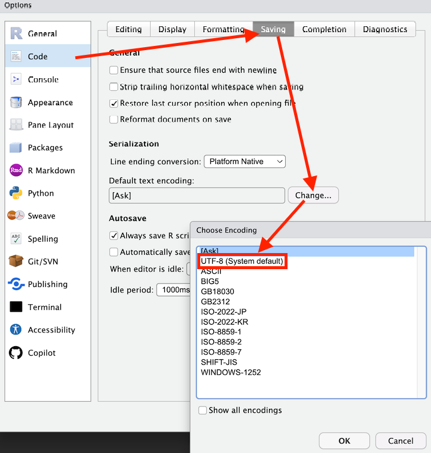
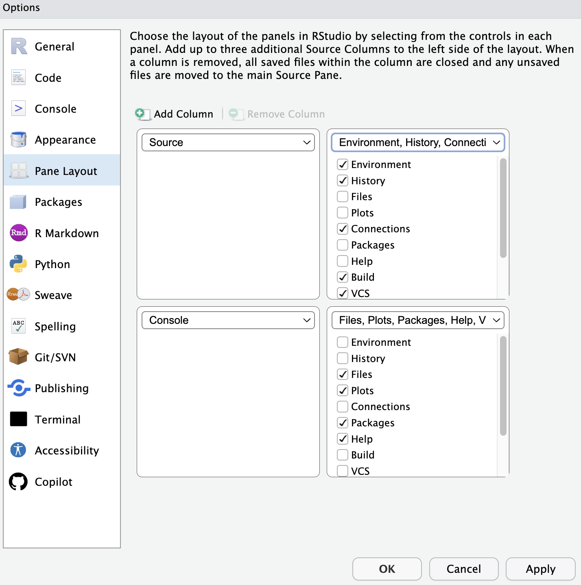
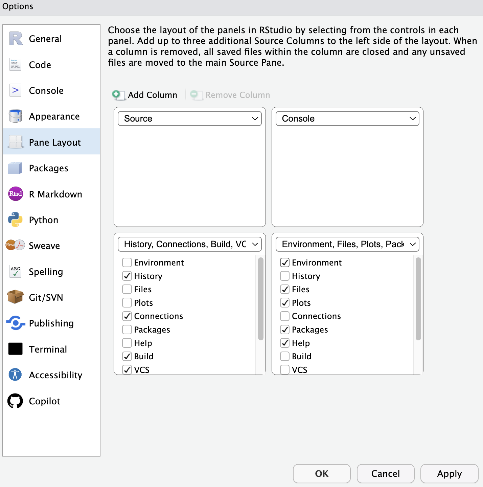

# RStudioインストール後の準備

## 1. 文字コードを UTF-8 に設定する

1. RStudio を起動します。
2. メニューの **Tools › Global Options** を開き、左の **Code** › **Saving** を選びます。
3. "Default text encoding" が "UTF-8" になっていることを確認します。

   

   (System defaultがUTF-8であればそのままでも問題ないはずですが、4を行うと確実です)

4. もし別の文字コードになっている場合は "Change..." から "UTF-8" を選択してください。

## 2. ペインのレイアウトを変更する

1. **Tools › Global Options** の **Pane Layout** を開きます。



2. 右上を"Console" にします。
3. 右下のペインに "Environment" を追加します。

   

4. 見た目のカスタマイズ

   設定の**Appearance**ではスクリプトのフォントや色の設定ができます。
   完全に好みなので、自由に設定してみてください。

## 3. プロジェクトを作成する

プロジェクトについての細かい解説は[noteの記事](https://note.com/mitti1210/n/nc4166e4d1cf1)を参考にしてください。

1. 右上の "Project: (None)" をクリックし、**New Project...** を選びます。
2. **New Directory** › **New Project** を選択します。
3. フォルダ名に `好きなフォルダ名` を入力し、保存場所は **ドキュメント** もしくは **デスクトップ** など任意の場所を選びます。
4. そのまま **Create Project** を押します。
5. 解析に使うデータやセミナーでもらったデータがある場合はこのフォルダ内にエクスプローラやFinderを使い移動させます。

## 4. 必要なパッケージをインストールする

1. Console に次の 2 行を貼り付け、Enter を押します。

```r
install.packages("pacman")
pacman::p_load(skimr, comorbidity, broom, tidyverse, here, openxlsx, tableone)
```

ここでは `pacman::p_load` を使っていますが、rigを使いRをインストールした方は`pak` パッケージの `pak::pak()` でインストールするとより高速に安全にインストールができます。

```r
pak::pak("skimr", "comorbidity", "broom", "tidyverse", "here", "openxlsx", "tableone", "gtusmmary")
```

これでセミナーで使う R の準備は完了です。
