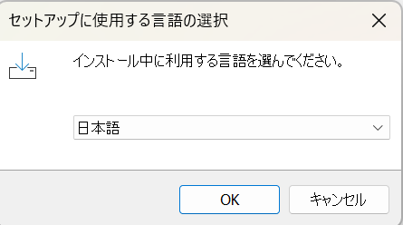
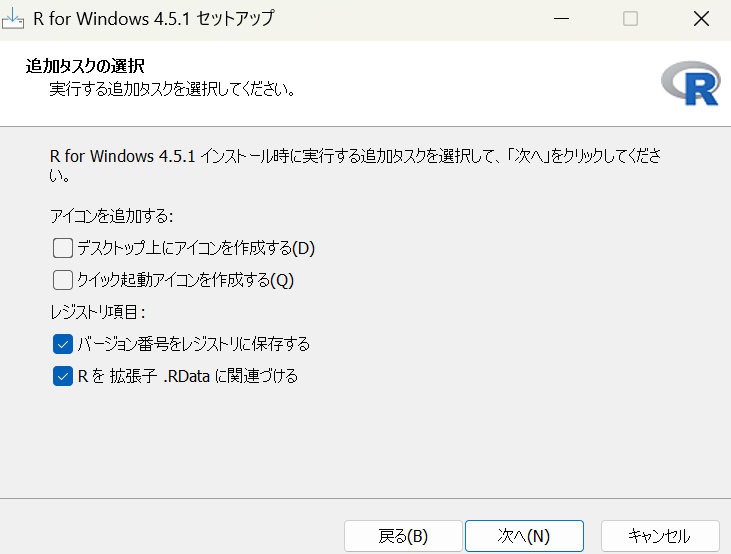

# Windows: RStudio サイトからのインストール

RStudio のサイトから R・Rtools・RStudio を順番に入れる、もっとも一般的な方法です。迷ったらまずはこの手順で大丈夫です。PowerShell の開き方やコマンドの貼り付け方から丁寧に説明します。

> [!NOTE]
> RStudio は Windows 10 以降のみサポートされています。Windows 7/8 を利用している場合は、OS を Windows 10 以上にアップグレードすることをおすすめします。旧OSでのインストールは過去バージョンを自己責任で導入してください。 詳細はこちら: [Windows7/8に関する注意点](windows-r-japanese-path-issues.md)。

## 0. PowerShell を管理者として開く

1. 画面左下の **スタートボタン** をクリックします。
2. 検索欄に `powershell` と入力します。
3. 表示された **Windows PowerShell** を右クリックし、「**管理者として実行**」を選びます。


4. 「このアプリがデバイスに変更を加えることを許可しますか?」と出たら **はい** をクリックします。
5. 黒い画面が開き、ここに文字を入力します。これを **PowerShell（コマンドライン）** と呼びます。
   - この後に出てくる命令文をマウスで選択し、右クリックで貼り付け、**Enter キー**を押すだけで実行できます。
   - 画面に `>` が表示されているときに入力できます。表示されていない間は前のコマンドが処理中なので、`>` が再び出るまで待ちます。
   - パスワードの入力を求められた場合、画面には文字が表示されませんが、そのまま入力して **Enter キー** を押してください。

## 1. アカウントの確認


1. PowerShell で次のコマンドを実行し、表示された名前を確認します。

```powershell
$Env:USERNAME
```

英数字であれば問題ありません。もし日本語が含まれる場合は英数字のみのアカウントを新規作成し、管理者権限を付与してください。[ローカルユーザーまたは管理者アカウントを作成する方法](https://support.microsoft.com/ja-jp/windows/windows-%E3%81%A7%E3%83%A6%E3%83%BC%E3%82%B6%E3%83%BC-%E3%82%A2%E3%82%AB%E3%82%A6%E3%83%B3%E3%83%88%E3%82%92%E7%AE%A1%E7%90%86%E3%81%99%E3%82%8B-104dc19f-6430-4b49-6a2b-e4dbd1dcdf32) 

2. 続けて以下を実行し、`AMD64` か `ARM64` が表示された方を控えておきます。後で Rtools を選ぶときに使います。

```powershell
$Env:PROCESSOR_ARCHITECTURE
```


## 2. ライブラリ用フォルダの作成

R のパッケージを保存するフォルダを作ります。PowerShell で次を実行し、表示されたパスを控えておきます。

```powershell
mkdir C:\Users\$Env:USERNAME\Documents\R\libs
```

## 3. 環境変数の追加

1. スタートボタンをクリックし、検索欄に `env` と入力します。
2. **環境変数の編集** を選びます。
3. 「ユーザー環境変数」の欄で **新規(N)** をクリックし、以下を入力します。
   - 変数名: `R_LIBS_USER`
   - 変数値: `C:\Users\●●\Documents\R\libs`

   ●●は`$Env:USERNAME`の結果を入力します。例えば`$Env:USERNAME`の結果が`hogehoge`なら変数値は`C:\Users\hogehoge\Documents\R\libs`となります。

4. OK を押してすべて閉じます。

## 4. R / Rtools / RStudio のインストール

1. ブラウザで [RStudio のダウンロードページ](https://posit.co/download/rstudio-desktop/) を開きます。
2. ページ内の **Download AND INSTALL R** をクリックし、表示された CRAN のページで **base** を選びます。

   

3. 上にある **Download R-x.y.z for Windows** のようなリンクからインストーラ (`R-x.x.x-win.exe`) をダウンロードし、起動します。バージョン番号 (`x.x.x`) は最新のものに置き換わります。

   

   インストーラでは案内に従って「Next」を押し、ライセンスに同意し、インストール場所もデフォルトのままで構いません。最後に「Finish」で閉じます。

   

   日本語を選択

   

   次へを選択

   

   次へを選択

   

   全てチェックがついていることを確認して次へを選択

   

   デフォルトのままで次へを選択

   

   次へを選択

   

   上2つは好みに合わせて。下2つはチェックをつけ次へを選択

   

   インストールが終わるのを待つ

   

   完了を選択

   

   ダウンロードしたインストーラーはゴミ箱に捨ててOK

4. 前のページに戻り **Rtools** を選び、インストールした R のバージョンをクリックします。

   

   

   
   
   - ダウンロードしたRに対応したRtoolsのバージョンを選択します。
     
   - ページの中ほどに「Rtools45 may be installed from the Rtools45 installer or 64-bit ARM Rtools45 installer. It is recommended to use the defaults, including the default installation location of C:\rtools45.」のような記載があるので、先ほど `$Env:PROCESSOR_ARCHITECTURE` で確認した結果に合わせて `Rtools45 installer` (AMD64) か `64-bit ARM Rtools45 installer` (ARM64) のどちらかを選びます。ここでの `45` は R のバージョンによって変わることがあります。
   - Rtools のダウンロードは容量が大きいため、回線や PC によってはダウンロード・インストールに 10 分ほどかかることがあります。

5. ダウンロードした Rtools のインストーラを起動し、案内に従って「次へ」を押し続け、最後に「完了」で閉じます。
6. 再度 ブラウザで [RStudio のダウンロードページ](https://posit.co/download/rstudio-desktop/) を開き、**DOWNLOAD RSTUDIO DESKTO FOR WINDOWS ** をクリックしダウンロードします。

   
   
   - ダウンロードしたインストーラーを開き、基本的に「次へ」を押し続け、最後に「完了」で閉じれば大丈夫です。
   - インストール後はインストーラーを削除してください。

## 5. RStudio の初期設定とパッケージのインストール

RStudio の初期設定や必要なパッケージの導入については [RStudioインストール後の準備について](rstudio-post-install.md) を参照してください。

## 6. 上手くインストールできるか確認する

1. RStudio のコンソールで次を実行します。

   ```r
   install.packages("pacman")
   library(pacman)
   p_loaded()
   ```

   `p_loaded()` に `pacman` が表示されれば R とライブラリの設定は正常です。表示されない（`character(0)` が出る、`library(pacman)` で「there is no package called 'pacman'」と表示される）場合はインストールに失敗しています。

### トラブルが起きたときは？

- `install.packages()` が `C:\Users\<ユーザー名>\OneDrive\??????\R\win-library\...` のようなパスで止まる場合は、`R_LIBS_USER` 環境変数が正しく設定されているか確認してください。

---

環境は一人ひとり異なるため、手順どおりに進めてもトラブルが発生することがあります。エラーが出たときはウェブ検索や生成 AI を活用すると解決できることが多いです。
